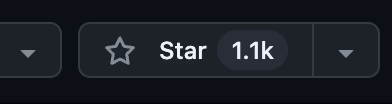

<div align="center">
  
  
  
  
  **LLM Agent Copyright Protection & Provenance Watermarking Framework**

  [简体中文](README.md) | [English](README_en.md)

  [](https://arxiv.org/abs/2601.03294)
  [](https://www.bilibili.com/video/BV1VwNFzSEuW/?share_source=copy_web&vd_source=c233de0ad9e4079e7d62230ed368e22e)
  
  
</div>

<br>

<div align="center">
🌟 Star AgentMark on GitHub and stay instantly updated on new releases.
</div>

<br>

<div align="center">
  <a href="https://github.com/Tooooa/AgentMark/stargazers">
    
  </a>
</div>

<br>

<div align="center">
  
</div>

---

**AgentMark** is an experimental and evaluation framework for **behavioral watermarking of LLM agents**, implementing the utility-preserving and distribution-preserving watermark algorithms proposed in the **Agent Mark** paper.

### 🎥 Demo Video

**AgentMark Full Workflow Behavioral Forensics Toolbox**

https://github.com/user-attachments/assets/c4e3f2c9-5939-490c-93d1-4b30b47c481e

<br>

For higher quality:
[→ Watch on Bilibili](https://www.bilibili.com/video/BV1VwNFzSEuW/?share_source=copy_web&vd_source=c233de0ad9e4079e7d62230ed368e22e)

The project provides a reproducible, modular, and extensible codebase to evaluate watermark performance, robustness, and stealth in complex agent tasks. It decomposes agent decision-making into **planning behavior** and **execution action**, embedding watermarks at the planning stage via distribution-preserving sampling to maintain downstream utility while enabling verifiable ownership protection.

<div align="center">
  
</div>

<h3 align="center">📷 Interface Preview</h3>

<div align="center">

<table align="center">
  <tr>
    <td align="center" width="50%">
      <strong>🤖 Platform Homepage</strong><br>
      <br>
      Quick access and task management
    </td>
    <td align="center" width="50%">
      <strong>⚔️ Watermark Comparison Mode</strong><br>
      <br>
      Compare behavior between watermarked and non-watermarked agents
    </td>
  </tr>
  <tr>
    <td align="center" width="50%">
      <strong>📄 Real-time Logs</strong><br>
      <br>
      View agent reasoning and execution process in real-time
    </td>
    <td align="center" width="50%">
      <strong>🛡️ Robustness Verification</strong><br>
      <br>
      Simulate log loss to verify watermark decoding
    </td>
  </tr>
</table>

</div>

### ✨ Key Features
- **💎 Utility Preservation**: Strict distribution-preserving sampling keeps watermarked behavior statistically indistinguishable from the original.
- **🛡️ Robustness**: Erasure-resilient coding and context-bound randomness handle missing logs and truncated trajectories.
- **🔢 Multi-bit Capacity**: Supports embedding multi-bit information in a single trajectory for precise ownership attribution and provenance.
- **🌍 Multi-environment Support**: Covers tool use, embodied intelligence, and social simulations.

### 🎮 Supported Environments
- **🛠️ ToolBench**: Complex tool-using scenarios with real-world API calls.
- **🏠 ALFWorld**: Text-based interactive household decision tasks.
- **📱 Oasis (Twitter/Reddit)**: Social-media behavior watermarking experiments.

---

## 📖 Table of Contents
- [📖 Table of Contents](#-table-of-contents)
- [📂 Project Structure](#-project-structure)
- [🚀 Quick Start](#-quick-start)
  - [1. 🐳 Docker One-Line Deployment (Recommended)](#1--docker-one-line-deployment-recommended)
  - [2. ⚙️ Manual Environment Setup](#2-️-manual-environment-setup)
  - [3. Dashboard Visualization](#3-dashboard-visualization)
    - [📦 Download Retriever Cache (Required)](#-download-retriever-cache-required)
    - [🚀 Steps](#-steps)
  - [4. Plug-and-Play One-click Watermarking](#4-plug-and-play-one-click-watermarking)
    - [Step 1: Start Gateway Proxy (AgentMark Proxy)](#step-1-start-gateway-proxy-agentmark-proxy)
    - [Step 2: Verify Watermark Injection](#step-2-verify-watermark-injection)
    - [Framework Compatibility](#framework-compatibility)
- [📚 Experiment Guide](#-experiment-guide)
  - [1. ToolBench Tool Calling Experiment](#1-toolbench-tool-calling-experiment)
    - [📊 Dataset Preparation (Required)](#-dataset-preparation-required)
    - [🚀 Running Modes](#-running-modes)
  - [2. ALFWorld Embodied Intelligence Experiment](#2-alfworld-embodied-intelligence-experiment)
    - [📊 Dataset Preparation](#-dataset-preparation)
    - [🚀 Running Guide](#-running-guide)
  - [3. Oasis Social Media Experiment](#3-oasis-social-media-experiment)
  - [4. RLNC Robustness Evaluation](#4-rlnc-robustness-evaluation)
  - [5. Semantic Rewriting Robustness Evaluation](#5-semantic-rewriting-robustness-evaluation)
- [License](#license)
- [📄 Citation](#-citation)
---

## 📂 Project Structure

```text
AgentMark/
├── assets/                         # Project assets (images, PDF)
├── agentmark/                      # Core library: watermark algorithms & SDK
│   ├── core/                       # Core watermark logic (ECC, sampling)
│   ├── environments/               # Environment adapters (ToolBench, ALFWorld)
│   ├── data/                       # Bitstreams and configuration data
│   ├── proxy/                      # Gateway proxy for tool-use interception
│   └── sdk/                        # Client SDK for easy integration
├── dashboard/                      # Visualization Dashboard (Full-stack)
│   ├── server/                     # Backend server (FastAPI)
│   └── src/                        # Frontend source (React/Vite)
├── experiments/                    # Experimental implementations
│   ├── toolbench/                  # ToolBench API tool-use experiments
│   ├── alfworld/                   # ALFWorld embodied intelligence experiments
│   ├── oasis_watermark/            # Social-media experiments (Twitter/Reddit)
│   ├── rlnc_trajectory/            # RLNC robustness evaluation
│   └── semantic_rewriting/         # Semantic rewriting robustness tests
├── output/                         # Experiment outputs (logs, predictions)
├── docker-compose.yml              # Docker Compose (development)
├── docker-compose.prod.yml         # Docker Compose (production/one-line deploy)
├── environment.yml                 # Conda environment (Python 3.9)
├── requirements.txt                # Python dependencies (pip)
├── .env.example                    # Environment variable template
├── LICENSE                         # MIT License
├── README.md                       # English README
└── README_zh.md                    # Chinese README
```

## 🚀 Quick Start

### 1. 🐳 Docker One-Line Deployment (Recommended)

**No dependencies required** - deploy the full Web visualization platform with one command:

```bash
curl -fL https://raw.githubusercontent.com/Tooooa/AgentMark/main/docker-compose.prod.yml -o docker-compose.yml
docker-compose up -d
```

🎉 **Success!** Access the dashboard at http://localhost:8080

> **Note**: To use LLM APIs, create a `.env` file first:
> ```bash
> echo "DEEPSEEK_API_KEY=your_key_here" > .env
> ```

<details>
<summary>▶ More Docker Usage (Click to expand)</summary>

**Run experiment container:**
```bash
docker-compose up -d experiments
docker-compose exec experiments bash
```

**Manual image pull:**
```bash
docker pull toooa908/agentmark-backend:latest
docker pull toooa908/agentmark-frontend:latest
```
</details>

---

### 2. ⚙️ Manual Environment Setup

If you need to modify code or develop locally, follow these steps:

**Requirements**: Python 3.9+

```bash
# Create and activate environment
conda env create -f environment.yml
conda activate AgentMark

# Or install manually
pip install -r requirements.txt

# Configure environment variables
cp .env.example .env
# Edit .env and fill in your API keys
```

---

### 3. Dashboard Visualization

The dashboard provides interactive watermark experiments with real-time comparison and decoding analysis.

#### 📦 Download Retriever Cache (Required)

Since ToolBench API retrieval requires loading cache files, we recommend downloading the pre-built cache to skip the time-consuming indexing process. **This is required for running the frontend.**

1. **Download file**: Download `retriever_cache.zip` from [GitHub Releases](https://github.com/Tooooa/AgentMark/releases).
2. **Extract file**:
   ```bash
   # Navigate to project root
   cd AgentMark
   # Extract retriever cache to the specified directory
   unzip -o retriever_cache.zip -d experiments/toolbench/data/data/toolenv/tools
   ```

#### 🚀 Steps

1. **Requirements**: Node.js 18.0+, NPM, Python (AgentMark environment).
2. **Start Backend**:
   ```bash
   conda activate AgentMark
   python dashboard/server/app.py
   ```
3. **Start Frontend**:
   ```bash
   cd dashboard
   npm install && npm run dev
   ```
4. **Access**: Open `http://localhost:5173` in your browser.

---

### 4. Plug-and-Play One-click Watermarking

Gain behavioral watermarking capabilities with zero code changes. By simply pointing your existing Agent's API Base URL to the gateway address, you can instantly enable watermarking. This mode is designed for developers to quickly add copyright protection and provenance to existing Agent systems without modifying core logic.

#### Step 1: Start Gateway Proxy (AgentMark Proxy)

```bash
conda activate AgentMark
export DEEPSEEK_API_KEY=sk-your-key
export TARGET_LLM_MODEL=deepseek-chat
export AGENTMARK_TOOL_MODE=proxy
uvicorn agentmark.proxy.server:app --host 0.0.0.0 --port 8001
```

#### Step 2: Verify Watermark Injection

Observe real-time logs in the **gateway proxy terminal**:
- `[agentmark:scoring_request]`: Scoring instruction injection
- `[agentmark:tool_calls_proxy]`: Gateway-constructed tool calls
- `[watermark]`: Watermark results and visualization data

> **Note**: If you encounter `502 Bad Gateway`, run `export no_proxy=localhost,127.0.0.1,0.0.0.0`.

#### Framework Compatibility
AgentMark Proxy supports all Agent frameworks built on **OpenAI Chat Completions API** (e.g., OpenAI Swarm, LangChain, AutoGen).

- **✅ Supported**: Frameworks using the standard `/v1/chat/completions` endpoint. Simply configure `base_url`.
- **❌ Unsupported**: Frameworks using stateful APIs (e.g., Assistants API, Responses API) or non-OpenAI protocols.

> **Tip**: Chat Completions API is **stateless**, while Assistants API is **stateful**. The Proxy is designed for stateless operations and thus supports only the former.


---

## 📚 Experiment Guide

Detailed experimental guides are as follows:

### 1. ToolBench Tool Calling Experiment
- **Overview**: Simulates real-world API calling scenarios to evaluate watermark impact on tool usage and robustness.

#### 📊 Dataset Preparation (Required)

You must complete these steps before running ToolBench experiments:

1. **Download Dataset**: From the [ToolBench repository](https://github.com/OpenBMB/ToolBench), download the full dataset (~2-3 GB).
2. **Directory Config**: Place extracted `data` under `experiments/toolbench/data/`. Ensure structure:
   ```text
   experiments/toolbench/data/data/
   ├── test_query/
   ├── toolenv/tools/  # JSON definitions
   └── answer/
   ```

#### 🚀 Running Modes
- **Directory**: `experiments/toolbench/`
- **Two Running Modes**:
  | Mode | Config (`use_local_model`) | Description |
  |------|---------------------------|-------------|
  | **API Mode** | `false` (default) | Calls remote LLM APIs (e.g., DeepSeek, OpenAI), watermark embedded via behavioral sampling |
  | **Local Mode** | `true` | Loads local models (e.g., Llama-3), combines with SynthID text watermarking |
- **Run Pipeline**:
  ```bash
  conda activate AgentMark
  # Run full pipeline (baseline/watermark/evaluation)
  python experiments/toolbench/scripts/run_pipeline.py
  ```
- **Key Config**: `experiments/toolbench/configs/pipeline_config.json`
  - Switch mode: modify `common_config.use_local_model` to `true` or `false`
  - Local mode requires `local_model_path` pointing to model weights

### 2. ALFWorld Embodied Intelligence Experiment
- **Overview**: Text-based interactive household decision tasks, evaluating watermark impact on agent planning and execution.

#### 📊 Dataset Preparation
Datasets are downloaded automatically to `~/.cache/alfworld`, or run manually:
```bash
alfworld-download
```
Preconfigured in `experiments/alfworld/configs/base_config.yaml`.

#### 🚀 Running Guide
- **Directory**: `experiments/alfworld/`
- **Environment Install**:
  ```bash
  pip install alfworld  # Install on top of AgentMark environment
  ```
- **Run Pipeline**:
  ```bash
  conda activate AgentMark
  # Run full pipeline (baseline/watermark/evaluation)
  python experiments/alfworld/scripts/run_experiment.py --config experiments/alfworld/configs/config.json
  ```
- **Key Config**: `experiments/alfworld/configs/config.json`

### 3. Oasis Social Media Experiment
> [!NOTE]
> 1. The `oasis/` directory is a **modified submodule** containing customized watermark logic.
> 2. Use a separate `oasis` environment (Python 3.10+).

- **Environment Install**:
  ```bash
  # 1. Create environment (Python 3.10+ recommended)
  conda create -n oasis python=3.10 -y
  conda activate oasis
  
  # 2. Install Oasis package
  pip install camel-oasis
  ```
  See [Oasis README](experiments/oasis_watermark/oasis/README.md) for details.

- **Overview**: Simulates user behavior and watermark injection on Twitter and Reddit.
- **Directory**: `experiments/oasis_watermark/`
- **Twitter Experiment**:
  - Directory: `experiments/oasis_watermark/twitter_watermark_experiment/`
  - **Run**:
    ```bash
    cd experiments/oasis_watermark/twitter_watermark_experiment
    # Configure config.py or set DEEPSEEK_API_KEY environment variable
    python run_experiment.py
    # Run evaluation
    python evaluate_metrics_llm.py
    ```
- **Reddit Experiment**:
  - Directory: `experiments/oasis_watermark/reddit_watermark_experiment/`
  - **Run**:
    ```bash
    cd experiments/oasis_watermark/reddit_watermark_experiment
    python run_experiment.py
    # Run evaluation
    python evaluate_metrics_llm.py
    ```
  - **Note**: Simulates AI-related discussions in the `r/TechFuture` community.

### 4. RLNC Robustness Evaluation
- **Overview**: Tests RLNC (Random Linear Network Coding) watermark scheme recovery under packet loss/erasure scenarios.
- **Directory**: `experiments/rlnc_trajectory/`
- **Core Scripts**:
  | Script | Function |
  |--------|----------|
  | `scripts/rlnc_step_erasure_eval.py` | Erasure robustness evaluation (simulates various packet loss rates) |
  | `scripts/analyze_fpr.py` | **False Positive Rate (FPR) analysis** - simulates "no watermark" and "wrong key" attack scenarios |
- **Run Robustness Evaluation**:
  ```bash
  cd experiments/rlnc_trajectory
  python scripts/rlnc_step_erasure_eval.py --config rlnc_eval_config.json
  ```
- **Run FPR Analysis**:
  ```bash
  python scripts/analyze_fpr.py --config rlnc_fpr_config.json
  ```
- **Key Configs**: `rlnc_eval_config.json`, `rlnc_fpr_config.json`

### 5. Semantic Rewriting Robustness Evaluation
- **Overview**: Tests differential watermark robustness against semantic rewriting attacks.
- **Directory**: `experiments/semantic_rewriting/`
- **Run**:
  ```bash
  cd experiments/semantic_rewriting
  python scripts/robustness_test.py \
      --task data/001_task_0.json \
      --bits data/decoded_bits.json \
      --steps 5
  ```

---

## License

This project is licensed under the [MIT License](LICENSE).

---

## 📄 Citation

If you use this project in your research, please cite our paper:

```bibtex
@article{huang2026agentmark,
  title={AgentMark: Utility-Preserving Behavioral Watermarking for Agents},
  author={Huang, Kaibo and Tan, Jin and Wei, Yukun and Li, Wanling and Zhang, Zipei and Tian, Hui and Yang, Zhongliang and Zhou, Linna},
  journal={arXiv preprint arXiv:2601.03294},
  year={2026}
}
```

